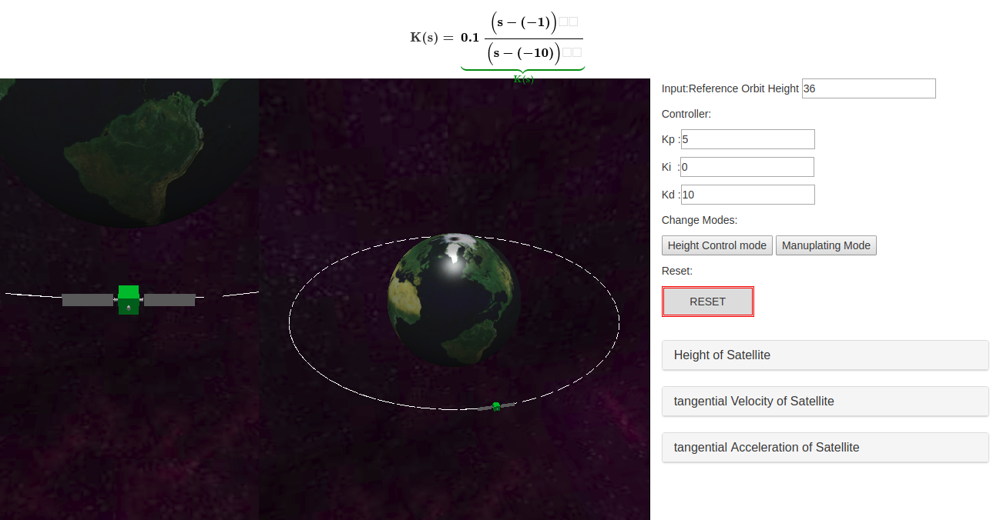
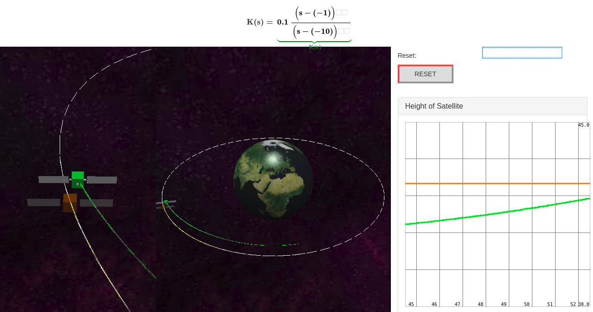

# Submission for Sitellite Model

## 1.'Simulink' folder :
includes Simulink models that implement the orbit-height control of the Satellite demo.  
## 2.'lib' folder 
## 3.'presentation' folder : 
slides and video demo for project presentation.
## 4.'project_bild' folder :
includes some screenshots and pictures that have been used in presentation and final report.
## 5.'src' folder :
Js code of the Web.
## 6.'index.html' file:
Web anomition of the Satellite orbit-height control demo.
### Hint : The Simulink model shout be activated before the web open.

## 7.'virtual-satellite-control.pdf' file:
Project report.
